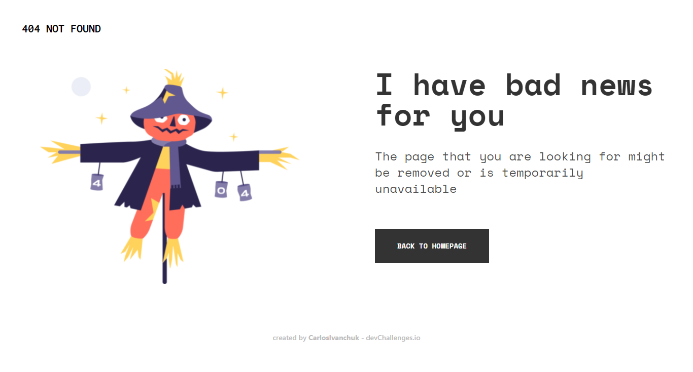

<!-- Please update value in the {}  -->

<h1 align="center">404 Not Found</h1>

   Solution for a challenge from  <a href="http://devchallenges.io" target="_blank">Devchallenges.io</a>.

  <h3>
    <a href="https://devchallenges-404-not-found.netlify.app/">
      Demo
    </a>
     | 
    <a href="https://github.com/CarlosIvanchuk/devchallenges-404-not-found">
      Solution
    </a>
     | 
    <a href="https://devchallenges.io/challenges/wBunSb7FPrIepJZAg0sY">
      Challenge
    </a>
  </h3>

<!-- TABLE OF CONTENTS -->

## Table of Contents

- [Overview](#overview)
  - [Built With](#built-with)
- [Features](#features)
- [Contact](#contact)
- [Acknowledgements](#acknowledgements)

<!-- OVERVIEW -->

## Overview

This simple 404 Not Found page was built using Svelte, SvelteKit and TailwindCSS. You can visit the demo at [devchallenges-404-not-found.netlify.app](https://devchallenges-404-not-found.netlify.app/). (It works well both on desktop and mobile)

It was relatively easy and very fun to build this project because I finished it in less than one day. I learned how to add custom fonts and custom colors —provided by the Figma design file— to the `tailwind.config.cjs` file, enabling custom utility classes like `bg-gray-1` or `font-space-mono`.

### Built With

<!-- This section should list any major frameworks that you built your project using. Here are a few examples.-->

- [Svelte](https://svelte.dev/)
- [SvelteKit](https://kit.svelte.dev/)
- [TailwindCSS](https://tailwindcss.com/)

## Features

<!-- List the features of your application or follow the template. Don't share the figma file here :) -->

This site was created as a submission to a [DevChallenges](https://devchallenges.io/challenges) challenge. The [challenge](https://devchallenges.io/challenges/wBunSb7FPrIepJZAg0sY) was to build an website to complete the given user stories.

## Acknowledgements

<!-- This section should list any articles or add-ons/plugins that helps you to complete the project. This is optional but it will help you in the future. For exampale -->

- [How to reference the default theme in TailwindCSS](https://tailwindcss.com/docs/theme#referencing-the-default-theme)

## Contact

- Website [carlosivanchuk.com](https://carlosivanchuk.com)
- GitHub [/CarlosIvanchuk](https://github.com/CarlosIvanchuk)
- Twitter [@CarlosIvanchuk](https://twitter.com/CarlosIvanchuk)
